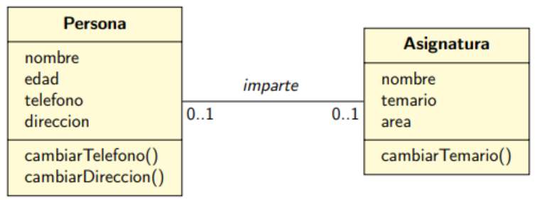
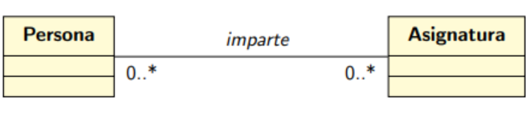
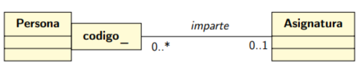
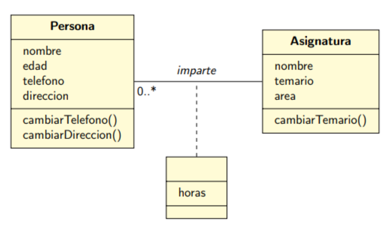
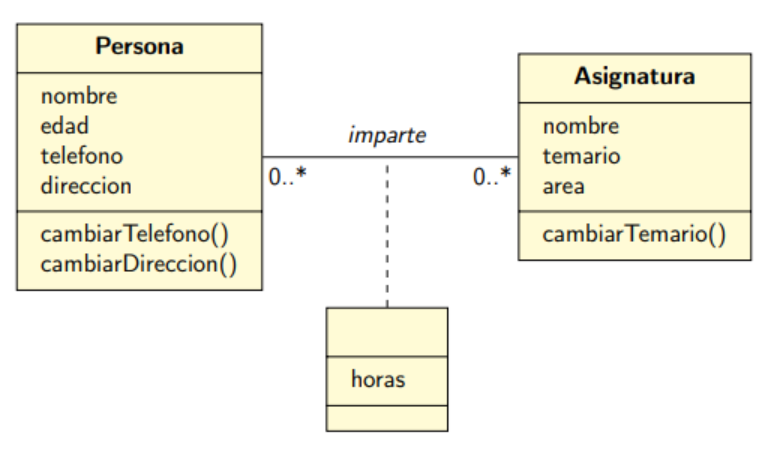

# Binary Relationships in C++

This repository contains code examples of different binary relationships implemented in C++, using various linear data structures such as `map`, `multimap`, and `set`. In addition, UML diagrams have been included to help visualize the data structures and their relationships, and pointers/references have been used to avoid possible data inconsistencies.

## 1-1

## varios-varios 

## calificada

## atributos-enlace

## atributos-enlace2

